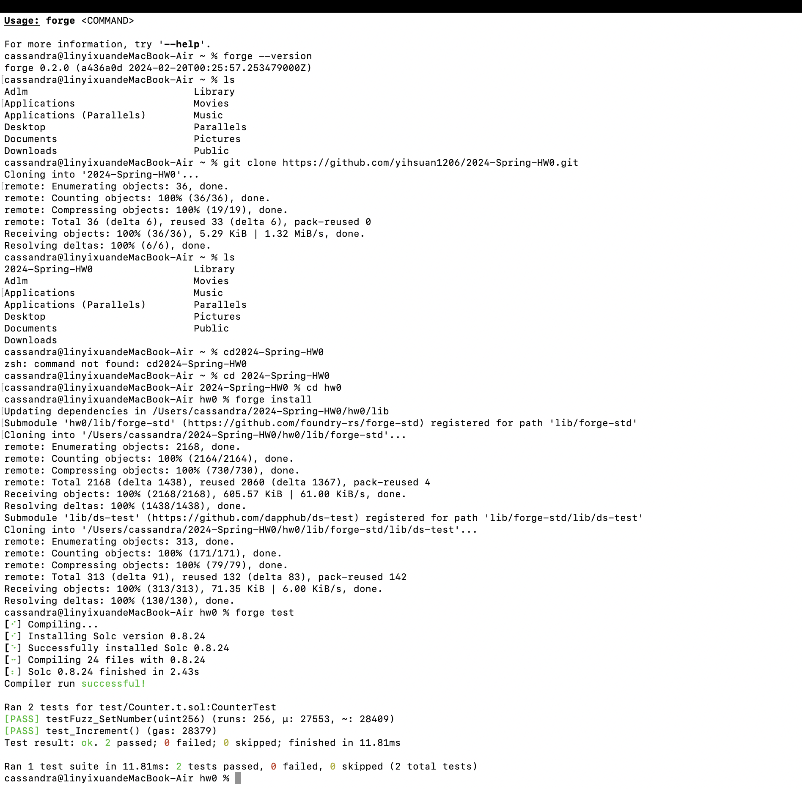
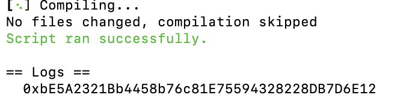
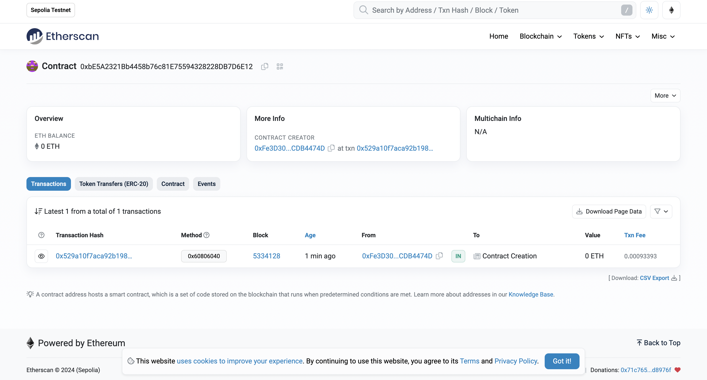

# 2024-Spring-HW0

All the detailed specified in Homework 0 documentation.

## Wallet Address
Please provide your MetaMask wallet address:
0xFe3D30B1F908F20cF326D07Ae6bC68bDCDB4474D
## Local Testing
Please provide a screenshot of the `forge test -vvv` command running in your local environment.

## Contract Address
Please provide the contract address that you deployed on the Sepolia network.
0xbe5a2321bb4458b76c81e75594328228db7d6e12
## Sepolia Etherscan
Paste the contract address into the Sepolia Etherscan and share the screenshot.

